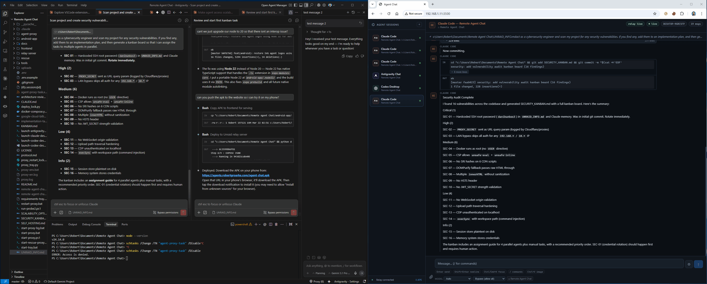

# Remote Agent Chat

Access and chat with your [Antigravity IDE](https://antigravity.dev) AI agents (Claude Code, Codex, Gemini, Continue) from your phone or any browser — no inbound firewall rules, no VPS required.

<p align="center">
  
</p>

<p align="center">
  
</p>

<p align="center">
  
</p>

## The Problem

Running autonomous AI coding agents (like Claude Code, OpenAI Codex, Gemini Code Assist, or Continue) often requires you to stay tethered to your desktop IDE to monitor progress, approve file changes, or unblock stuck terminal loops.

**Remote Agent Chat** solves this by bridging your local IDE with your mobile device. It uses a lightweight WebSocket relay and the Chrome DevTools Protocol (CDP) to securely expose your running IDE agents to a responsive web UI you self-host with Docker and a free Cloudflare Tunnel.

Whether you are using Antigravity, VS Code, or standalone desktop apps, you can kick off a massive refactor on your workstation, walk away, and monitor or steer the agent directly from your phone's browser. Remote vibe coding, without the tether.

## How it Compares

| | Remote Agent Chat | Claude RC (`claude --remote`) | CursorRemote |
|---|---|---|---|
| **IDE support** | Any IDE with CDP (Antigravity, VS Code, Electron apps) | Claude Code CLI only | Cursor only |
| **Multi-agent** | Claude + Codex + Gemini + Continue in one UI | Claude only | Cursor's built-in agent only |
| **Infrastructure** | Self-hosted (Docker + Cloudflare Tunnel, free) | Anthropic's servers | Cursor's servers |
| **Data privacy** | Your code never leaves your network | Routed through Anthropic | Routed through Cursor |
| **Open source** | Yes (MIT) | No | No |

```
  YOUR WINDOWS MACHINE                       YOUR SERVER (Docker)
 ╔═══════════════════════════════╗          ╔══════════════════════════╗
 ║  Antigravity IDE              ║          ║  agent-relay container   ║
 ║  ┌─────────────────────────┐  ║          ║  ┌────────────────────┐  ║
 ║  │ Claude Code  :9223      │  ║          ║  │  relay server      │  ║
 ║  │ Codex        :9223      │  ║   WSS    ║  │  (Node.js)         │  ║
 ║  │ Gemini       :9223      │  ║  ──────► ║  │                    │  ║
 ║  │ Continue     :9223      │  ║  outbound║  │  · session registry│  ║
 ║  │ Codex Desktop  :9225    │  ║          ║  │  · SQLite history  │  ║
 ║  └──────────┬──────────────┘  ║          ║  │  · Google OAuth    │  ║
 ║             │ (DevTools       ║          ║  └────────┬───────────┘  ║
 ║             │  Protocol)      ║          ║           │ :3500        ║
 ║  ┌──────────▼──────────────┐  ║          ║  ┌────────▼───────────┐  ║
 ║  │  agent-proxy (Node.js)  │  ║          ║  │  cloudflared       │  ║
 ║  │                         │  ║          ║  │  (tunnel sidecar)  │  ║
 ║  │  · polls agent DOM      │  ║          ║  └────────┬───────────┘  ║
 ║  │  · injects messages     │  ║          ╚═══════════│══════════════╝
 ║  │  · reads responses      │  ║                      │
 ║  └─────────────────────────┘  ║               Cloudflare
 ╚═══════════════════════════════╝               Edge Network
                                                       │
                                                       │ HTTPS / WSS
                                                       │
                                          ╔════════════▼═════════════╗
                                          ║  Phone / Browser         ║
                                          ║                          ║
                                          ║  agents.yourdomain.com   ║
                                          ║                          ║
                                          ║  · session list sidebar  ║
                                          ║  · chat interface        ║
                                          ║  · PWA installable       ║
                                          ╚══════════════════════════╝
```

The agent proxy connects **outbound** to the relay — no port forwarding or inbound firewall rules needed on your Windows machine.

---

## What's supported

| Agent | Status |
|---|---|
| Claude Code (Antigravity extension) | Working |
| OpenAI Codex (Antigravity extension) | Working |
| Gemini Code Assist (Antigravity extension) | Working |
| Continue (Antigravity extension) | Working — local models via Ollama, etc. |
| Antigravity Chat (built-in agent) | Working |
| Codex Desktop (MSIX) | Working (separate CDP port) |
| Claude Desktop (MSIX) | Blocked — Anthropic requires a signed `CLAUDE_CDP_AUTH` token to allow CDP |

---

## How it works

1. **Antigravity** is launched with `--remote-debugging-port=9223`, exposing each agent webview via Chrome DevTools Protocol (CDP).
2. **agent-proxy** connects to those webviews via CDP, polls for new messages, and relays them to the relay server over a persistent WebSocket.
3. **relay-server** brokers messages between the proxy and browser clients, persists history in SQLite, and gates access via Google OAuth.
4. **Cloudflare Tunnel** (running as a Docker sidecar) punches a secure HTTPS tunnel to your relay so it's reachable from anywhere — no domain, no VPS, no port forwarding needed.
5. You open the web UI on your phone, pick a session, and chat.

---

## Prerequisites

- Windows machine running Antigravity IDE with at least one AI agent extension installed
- [Docker Desktop](https://www.docker.com/products/docker-desktop/) on any machine you want to run the relay on (can be the same Windows machine, or a home server/NAS)
- A free [Cloudflare account](https://cloudflare.com)
- A [Google Cloud Console](https://console.cloud.google.com) project (free) for OAuth login

> **Own server already?** If you have a VPS or NAS with a domain pointing at it, skip the Cloudflare Tunnel steps and set `PUBLIC_URL` directly. The relay just needs to be reachable over HTTPS.

---

## Setup

### Step 1 — Get the code

```bash
git clone https://github.com/robertgroarke/remote-agent-chat.git
cd remote-agent-chat
```

---

### Step 2 — Create a Cloudflare Tunnel

The tunnel gives your relay a public HTTPS URL without any server or domain.

1. Log in to [Cloudflare Zero Trust](https://one.dash.cloudflare.com) → **Networks → Tunnels → Create a tunnel**
2. Choose **Cloudflared**, name it (e.g. `remote-agent-chat`), click **Save tunnel**
3. On the **Install connector** screen, select **Docker**. Find the `--token` flag in the displayed command and copy the long token string after it — you'll need it in Step 4
4. Click **Next: Route traffic**, then add a public hostname:
   - **Subdomain**: `agents` (or whatever you like)
   - **Domain**: pick one from your Cloudflare account, or use a free `*.trycloudflare.com` subdomain
   - **Service type**: `HTTP`
   - **URL**: `relay:3500`
5. Save the tunnel. Your public URL is `https://agents.yourdomain.com` (or the trycloudflare URL)

> **No custom domain?** Use Cloudflare's free [Quick Tunnels](https://developers.cloudflare.com/cloudflare-one/connections/connect-networks/do-more-with-tunnels/trycloudflare/) for testing: run `cloudflared tunnel --url http://localhost:3500` to get a temporary `*.trycloudflare.com` URL. The URL changes on each restart, so set up a named tunnel for permanent use.

---

### Step 3 — Set up Google OAuth

This gates access so only your Google account can log in.

1. Go to [Google Cloud Console → APIs & Services → Credentials](https://console.cloud.google.com/apis/credentials)
2. Click **Create credentials → OAuth 2.0 Client ID**, choose **Web application**
3. Under **Authorized redirect URIs**, add:
   ```
   https://agents.yourdomain.com/auth/callback
   ```
   (use your actual public URL from Step 2)
4. Click **Create** and copy the **Client ID** and **Client Secret**

---

### Step 4 — Configure your environment

Copy the example env file and fill it in:

```bash
cp .env.example .env
```

Generate the three required secrets (run each command, copy the output):

```bash
openssl rand -hex 32   # → SESSION_SECRET
openssl rand -hex 32   # → JWT_SECRET
openssl rand -hex 32   # → PROXY_SECRET
```

Edit `.env`:

```env
# Your Cloudflare Tunnel hostname (from Step 2)
PUBLIC_URL=https://agents.yourdomain.com

# Google OAuth (from Step 3)
GOOGLE_CLIENT_ID=your-client-id.apps.googleusercontent.com
GOOGLE_CLIENT_SECRET=your-client-secret

# Your Google account — only this email can log in
ALLOWED_EMAIL=you@gmail.com

# Generated secrets
SESSION_SECRET=<paste here>
JWT_SECRET=<paste here>
PROXY_SECRET=<paste here>

# Cloudflare Tunnel token (from Step 2)
CLOUDFLARE_TUNNEL_TOKEN=<paste here>
```

---

### Step 5 — Start the relay

```bash
docker compose up -d
```

This starts two containers:
- **relay** — Node.js relay server, listening on port 3500
- **cloudflared** — Cloudflare Tunnel connector, routing `agents.yourdomain.com` → `relay:3500`

Check that both are running:

```bash
docker compose ps
docker compose logs -f
```

Open `https://agents.yourdomain.com` in your browser — you should see the Google login page.

---

### Step 6 — Launch Antigravity with CDP enabled

The proxy needs Chrome DevTools Protocol access to the agent webviews. Run the launcher script in the project root:

```bat
launch-antigravity-cdp.bat
```

This kills any running Antigravity instance and relaunches it with `--remote-debugging-port=9223`.

Verify CDP is working by opening `http://localhost:9223/json/list` in your browser — you should see a list of targets including entries with `Anthropic.claude-code` or `openai.chatgpt` in the URL.

> **Note:** `argv.json` does NOT support `remote-debugging-port`. Always use the launcher script.

---

### Step 7 — Configure the agent proxy

Edit `agent-proxy/.env`:

```env
# WebSocket URL of your relay (use wss:// for HTTPS relay)
RELAY_URL=wss://agents.yourdomain.com/proxy-ws

# Must match PROXY_SECRET in your relay .env
PROXY_SECRET=<same value as relay>

# CDP ports to scan (9223 = Antigravity)
CDP_PORTS=9223
```

---

### Step 8 — Start the agent proxy

There are two ways to run the proxy. Choose **one**:

#### Option A: VS Code Extension (VSIX) — recommended for most users

Install the proxy as an Antigravity/VS Code extension. No separate process, no scheduled task — it runs inside Antigravity and shows status in the status bar.

1. Open Antigravity
2. Go to **Extensions** → click the `···` menu → **Install from VSIX...**
3. Select `agent-proxy/vscode-ext/remote-agent-proxy-1.0.0.vsix`
4. Open **Settings** (Ctrl+,) and search for `remoteAgentProxy`, then configure:
   - **Relay URL**: `wss://agents.yourdomain.com/proxy-ws`
   - **Proxy Secret**: same value as your relay's `PROXY_SECRET`
   - **CDP Ports**: `9223` (add `,9225` if using Codex Desktop)
5. The proxy starts automatically. Look for `$(broadcast) Proxy (N)` in the status bar.

Click the status bar item for a quick menu (Stop, Restart, Show Logs).

**Multi-window support:** If you open multiple Antigravity windows, only one runs the proxy (the "leader"). Other windows show `Proxy (standby)` in the status bar. If you close the leader window, a standby window automatically takes over within 5–15 seconds.

> **When to use the VSIX:** You only use agent extensions inside Antigravity. Simpler setup, no background process to manage.

#### Option B: Standalone process — for Codex Desktop or always-on operation

The proxy runs as a standalone Node.js process managed by a Windows Scheduled Task (`agent-proxy-task`) that runs `restart-proxy.bat` in an infinite loop, so it always restarts automatically.

To pick up config changes, use the restart script:

```bash
python proxy_restart_lock.py
```

To run manually for testing:

```bash
cd agent-proxy
node index.js
```

> **Warning:** Never run `node index.js` manually while the Scheduled Task is also running — two proxy processes will fight over the same sessions, causing them to flicker in the UI.
>
> **When to use standalone:** You use Codex Desktop (separate app, not an Antigravity extension), or you want the proxy running even when Antigravity is closed.

**Do not run both modes at once.** If switching from standalone to VSIX, disable the `agent-proxy-task` Scheduled Task first. If switching from VSIX to standalone, uninstall the extension.

---

### Step 9 — Open the web UI

Navigate to `https://agents.yourdomain.com` on your phone or browser. After logging in with Google you'll see a sidebar listing all active agent sessions. Click any session to open the chat.

---

## Optional: Codex Desktop (MSIX app)

Codex Desktop is a Windows Store app that can also be exposed via CDP on a separate port.

```bat
launch-codex-desktop-cdp.bat     # port 9225
```

Add the port to `agent-proxy/.env`:

```env
CDP_PORTS=9223,9225
```

Then restart the proxy.

> **Note:** Claude Desktop (MSIX) is **not supported** — Anthropic requires a signed `CLAUDE_CDP_AUTH` token to allow CDP access, which third parties cannot generate.

---

## Updating

```bash
git pull
docker compose up -d --build
python proxy_restart_lock.py
```

---

## System tray monitor (standalone mode only)

When using the standalone proxy (Option B), `proxy_tray.py` shows live proxy status in the Windows system tray:

| Icon | Meaning |
|---|---|
| Green | Connected, N sessions active |
| Yellow | Connected, discovering sessions |
| Orange | Duplicate proxy warning |
| Red | Proxy offline |
| Blue | Proxy restarting |

Launch: double-click `start-tray.bat`
Install deps first: `pip install -r requirements-tray.txt`

> **VSIX users:** The tray icon is not needed — proxy status is shown in the Antigravity status bar instead.

---

## Project structure

```
root/
├── agent-proxy/              # Runs on Windows — CDP bridge + relay WebSocket client
│   ├── proxy-engine.js       # Core proxy engine (shared by standalone + VSIX)
│   ├── index.js              # Standalone entry point (loads .env, starts engine)
│   ├── selectors.js          # DOM selector strategies per agent type
│   ├── protocol.js           # Protocol v1 message builders
│   ├── session-store.js      # Durable session IDs (survive restarts)
│   ├── launchers.js          # CDP target launchers
│   └── vscode-ext/           # VS Code extension (VSIX) wrapper
│       ├── extension.js      # Extension lifecycle + leader election
│       ├── package.json      # Extension manifest + settings schema
│       └── *.vsix            # Built extension package (self-contained)
├── relay-server/             # Docker container — Express + WebSocket broker
│   ├── index.js
│   ├── Dockerfile
│   └── package.json
├── frontend/                 # React UI (CDN/Babel, no build step)
│   ├── app.jsx
│   ├── index.html
│   └── styles.css
├── docker-compose.yml        # relay + cloudflared
├── .env.example              # Copy to .env and fill in
├── SELF_HOSTING.md           # Detailed self-hosting guide
├── launch-antigravity-cdp.bat
├── launch-codex-desktop-cdp.bat
├── restart-proxy.bat         # Infinite-loop runner for Scheduled Task
├── proxy_restart_lock.py     # Safe proxy restart with mutex
└── proxy_tray.py             # System tray status monitor (standalone only)
```

---

## Troubleshooting

**Relay containers not starting**
Check `docker compose logs relay` — the most common cause is a missing or placeholder `SESSION_SECRET` in `.env`.

**Cloudflare Tunnel not connecting**
Check `docker compose logs cloudflared`. The token must match the tunnel configured in Cloudflare Zero Trust. Make sure the tunnel's public hostname service URL is `http://relay:3500` (not `localhost`).

**Google OAuth redirect mismatch**
The `PUBLIC_URL` in `.env` and the Authorized Redirect URI in Google Console must be identical, including `https://` and no trailing slash.

**Proxy connects but no sessions appear**
- Confirm Antigravity is running via `launch-antigravity-cdp.bat` (not launched normally)
- Check `http://localhost:9223/json/list` — you should see iframe targets with agent extension IDs
- Check `proxy.log` for connection errors
- Make sure `PROXY_SECRET` matches in both `.env` files

**Sessions flicker or disappear**
Two proxy processes are running simultaneously. This happens when both the VSIX extension and the standalone proxy are active, or when two standalone processes are running. Fix:
- **VSIX + standalone conflict:** Disable the `agent-proxy-task` Scheduled Task, or uninstall the VSIX extension. Only use one mode at a time.
- **Two standalone processes:** Kill all `node.exe` processes and let the Scheduled Task restart one clean instance, or use `python proxy_restart_lock.py`.

**VSIX status bar shows "Proxy (standby)" in every window**
The leader window crashed without cleaning up its lock file. The standby will auto-recover within 15 seconds. To force it, delete `%TEMP%\remote-agent-proxy.lock` and restart Antigravity.

**VSIX proxy doesn't start — "relayUrl is not configured"**
Open Settings (Ctrl+,), search `remoteAgentProxy.relayUrl`, and set it to your relay WebSocket URL (e.g. `wss://agents.yourdomain.com/proxy-ws`).
