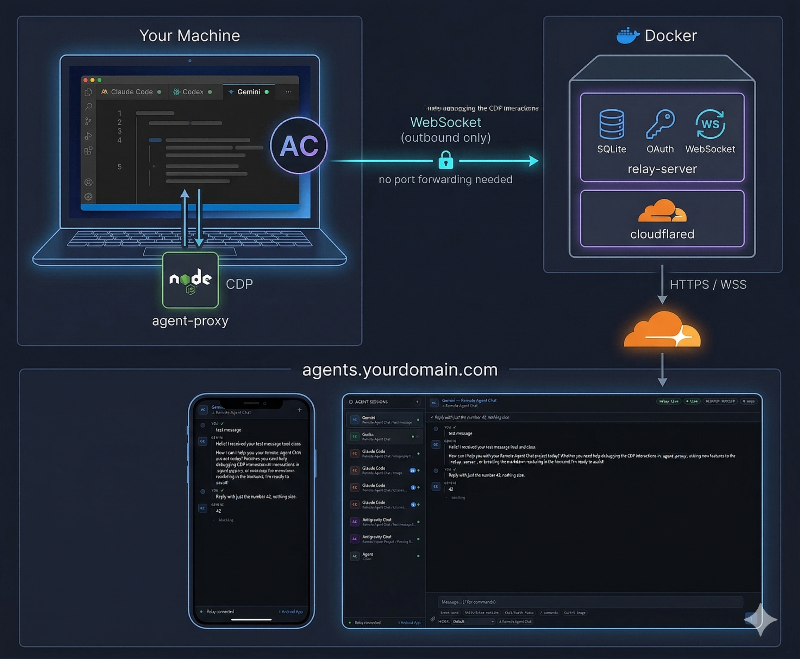
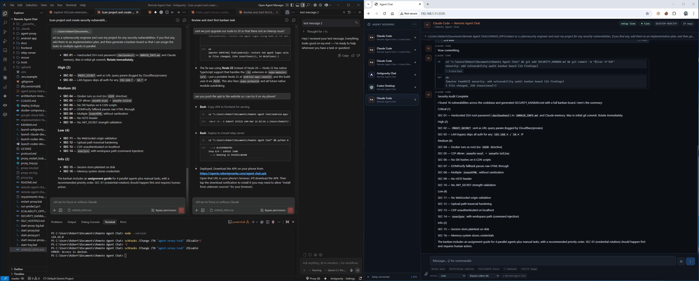
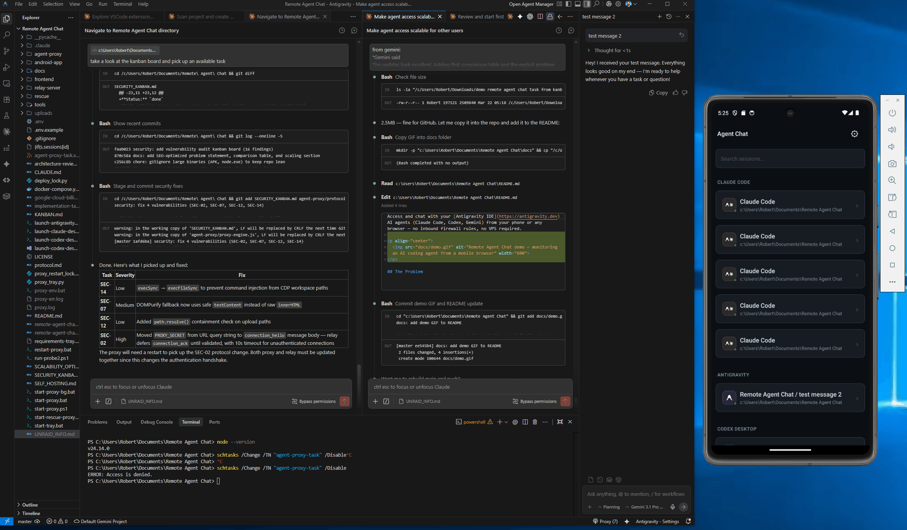

# Remote Agent Chat

Access and chat with your [Antigravity IDE](https://antigravity.dev), Antigravity v2 Agent Manager, desktop agents, and CLI agents (Claude Code, Claude Code CLI, Codex, Codex CLI, Gemini, Continue, Continue YOLO, Roo Code, Cline) from your phone or any browser - no inbound firewall rules, no VPS required.

<p align="center">
  
</p>

<p align="center">
  
</p>

<p align="center">
  
</p>

## The Problem

Running autonomous AI coding agents (like Claude Code, Claude Code CLI, OpenAI Codex, Codex CLI, Gemini Code Assist, Continue, Roo Code, or Cline) often requires you to stay tethered to your desktop IDE or terminal to monitor progress, approve file changes, or unblock stuck terminal loops.

**Remote Agent Chat** solves this by bridging your local IDE with your mobile device. It uses a lightweight WebSocket relay and the Chrome DevTools Protocol (CDP) to securely expose your running IDE agents to a responsive web UI you self-host with Docker and a free Cloudflare Tunnel.

Whether you are using Antigravity, VS Code, or standalone desktop apps, you can kick off a massive refactor on your workstation, walk away, and monitor or steer the agent directly from your phone's browser. Remote vibe coding, without the tether.

## How it Compares

| | Remote Agent Chat | Claude RC (`claude --remote`) | CursorRemote |
|---|---|---|---|
| **IDE support** | Any IDE with CDP (Antigravity IDE, Antigravity v2, VS Code, Electron apps) plus CLI transcripts | Claude Code CLI only | Cursor only |
| **Multi-agent** | Claude + Codex + Codex CLI + Gemini + Continue + Roo Code + Cline + Antigravity v2 in one UI | Claude only | Cursor's built-in agent only |
| **Infrastructure** | Self-hosted (Docker + Cloudflare Tunnel, free) | Anthropic's servers | Cursor's servers |
| **Data privacy** | Your code never leaves your network | Routed through Anthropic | Routed through Cursor |
| **Open source** | Yes (MIT) | No | No |

```
  YOUR WINDOWS MACHINE                       YOUR SERVER (Docker)
 ╔═══════════════════════════════╗          ╔══════════════════════════╗
 ║  Antigravity IDE              ║          ║  agent-relay container   ║
 ║  ┌─────────────────────────┐  ║          ║  ┌────────────────────┐  ║
 ║  │ Claude Code  :9223      │  ║          ║  │  relay server      │  ║
 ║  │ Codex        :9223      │  ║   WSS    ║  │  (Node.js)         │  ║
 ║  │ Gemini       :9223      │  ║  ──────► ║  │                    │  ║
 ║  │ Continue     :9223      │  ║  outbound║  │  · session registry│  ║
 ║  │ Roo Code     :9223      │  ║          ║  │  · SQLite history  │  ║
 ║  │ Codex Desktop  :9225    │  ║          ║  │                    │  ║
 ║  └──────────┬──────────────┘  ║          ║  │  · Google OAuth    │  ║
 ║             │ (DevTools       ║          ║  └────────┬───────────┘  ║
 ║             │  Protocol)      ║          ║           │ :3500        ║
 ║  ┌──────────▼──────────────┐  ║          ║  ┌────────▼───────────┐  ║
 ║  │  agent-proxy (Node.js)  │  ║          ║  │  cloudflared       │  ║
 ║  │                         │  ║          ║  │  (tunnel sidecar)  │  ║
 ║  │  · polls agent DOM      │  ║          ║  └────────┬───────────┘  ║
 ║  │  · injects messages     │  ║          ╚═══════════│══════════════╝
 ║  │  · reads responses      │  ║                      │
 ║  └─────────────────────────┘  ║               Cloudflare
 ╚═══════════════════════════════╝               Edge Network
                                                       │
                                                       │ HTTPS / WSS
                                                       │
                                          ╔════════════▼═════════════╗
                                          ║  Phone / Browser         ║
                                          ║                          ║
                                          ║  agents.yourdomain.com   ║
                                          ║                          ║
                                          ║  · session list sidebar  ║
                                          ║  · chat interface        ║
                                          ║  · PWA installable       ║
                                          ╚══════════════════════════╝
```

The agent proxy connects **outbound** to the relay — no port forwarding or inbound firewall rules needed on your Windows machine.

The WebUI groups active sessions by workspace directory in the sidebar and shows each chat/thread title as the session label. File paths, screenshot attachment names, and native window titles are filtered out as low-signal titles, so multiple agents working in the same repo stay organized without turning implementation details into chat names.

---

## What's supported

| Agent | Status |
|---|---|
| Claude Code (Antigravity extension) | Working |
| Claude Code CLI | Working - WebUI sessions, Ollama Cloud models, and native Windows terminal handoff |
| OpenAI Codex (Antigravity extension) | Working - side-pane chat, task/completion summaries, tool output, files/changes panels, and retained transcript history |
| OpenAI Codex CLI | Working - WebUI sessions, elevated native terminal handoff, active multi-session discovery, full tool output, bottom live goal/working status, stable scroll anchoring, and newest-first chunked transcript hydration |
| Gemini Code Assist (Antigravity extension) | Working |
| Continue (Antigravity extension) | Working — local models via Ollama, etc. |
| Continue YOLO (Antigravity extension) | Working — editor-tab sessions with bypass-permissions support |
| Roo Code (Antigravity extension) | Working — side-pane sessions with permission dialog support |
| Cline (Antigravity extension) | Working — side-pane sessions with Plan/Act mode, context usage, and permission dialog support |
| Antigravity Chat (built-in agent) | Working |
| Antigravity v2 Agent Manager (standalone app) | Working - standalone CDP port, project/conversation navigator, history/scheduled-task entry points, new conversation, chat switching, rich transcript blocks |
| Codex Desktop (MSIX) | Working (separate CDP port) |
| Claude Desktop (MSIX) | Blocked — Anthropic requires a signed `CLAUDE_CDP_AUTH` token to allow CDP |

Antigravity v2 is treated as a separate standalone Agent Manager surface, not as the Antigravity IDE side pane. The WebUI exposes its project/conversation controls where available, including conversation history, scheduled-task entry points, project/sub-chat switching, and new conversation launch. v2 transcripts preserve rich assistant output such as markdown, thinking, tool calls, terminal output, file-change summaries, artifacts, prompts, and errors.

Codex CLI support covers both WebUI-launched sessions and active native terminal sessions. The proxy follows recent Codex CLI transcript files, surfaces multiple active sessions, preserves full tool-call/result output, opens native sessions elevated on Windows, and renders live task-plan status near the composer, including `Pursuing goal (...)` and `Working (... esc to interrupt)`. Large archived transcripts are kept selectable without blocking initial sidebar hydration, and active sessions stay pinned to the newest output while older history backfills.

Transcript history hydrates newest-first across agent types. The WebUI shows the most recent messages first, then incrementally backfills older history in chunks. Backfilled chunks preserve the reader's scroll position, while chats already pinned to the bottom stay pinned to the newest messages. Codex CLI uses the same UX while reading its native JSONL transcript archive in bounded byte ranges.

---

## How it works

1. **Antigravity IDE** is launched with `--remote-debugging-port=9223`, exposing each agent webview via Chrome DevTools Protocol (CDP). Optional standalone apps use separate ports: Codex Desktop on `9225`, Antigravity v2 Agent Manager on `9226`.
2. **agent-proxy** connects to those webviews via CDP, polls for new messages, follows local CLI transcript files for Claude Code CLI and Codex CLI sessions, and relays them to the relay server over a persistent WebSocket.
3. **relay-server** brokers messages between the proxy and browser clients, persists history in SQLite, and gates access via Google OAuth.
4. **Cloudflare Tunnel** (running as a Docker sidecar) punches a secure HTTPS tunnel to your relay so it's reachable from anywhere — no domain, no VPS, no port forwarding needed.
5. You open the web UI on your phone, pick a session, and chat.

---

## Prerequisites

- Windows machine running Antigravity IDE with at least one AI agent extension installed
- [Docker Desktop](https://www.docker.com/products/docker-desktop/) on any machine you want to run the relay on (can be the same Windows machine, or a home server/NAS)
- A free [Cloudflare account](https://cloudflare.com)
- A [Google Cloud Console](https://console.cloud.google.com) project (free) for OAuth login

> **Own server already?** If you have a VPS or NAS with a domain pointing at it, skip the Cloudflare Tunnel steps and set `PUBLIC_URL` directly. The relay just needs to be reachable over HTTPS.

---

## Setup

### Step 1 — Get the code

```bash
git clone https://github.com/robertgroarke/remote-agent-chat.git
cd remote-agent-chat
```

---

### Step 2 — Create a Cloudflare Tunnel

The tunnel gives your relay a public HTTPS URL without any server or domain.

1. Log in to [Cloudflare Zero Trust](https://one.dash.cloudflare.com) → **Networks → Tunnels → Create a tunnel**
2. Choose **Cloudflared**, name it (e.g. `remote-agent-chat`), click **Save tunnel**
3. On the **Install connector** screen, select **Docker**. Find the `--token` flag in the displayed command and copy the long token string after it — you'll need it in Step 4
4. Click **Next: Route traffic**, then add a public hostname:
   - **Subdomain**: `agents` (or whatever you like)
   - **Domain**: pick one from your Cloudflare account, or use a free `*.trycloudflare.com` subdomain
   - **Service type**: `HTTP`
   - **URL**: `relay:3500`
5. Save the tunnel. Your public URL is `https://agents.yourdomain.com` (or the trycloudflare URL)

> **No custom domain?** Use Cloudflare's free [Quick Tunnels](https://developers.cloudflare.com/cloudflare-one/connections/connect-networks/do-more-with-tunnels/trycloudflare/) for testing: run `cloudflared tunnel --url http://localhost:3500` to get a temporary `*.trycloudflare.com` URL. The URL changes on each restart, so set up a named tunnel for permanent use.

---

### Step 3 — Set up Google OAuth

This gates access so only your Google account can log in.

1. Go to [Google Cloud Console → APIs & Services → Credentials](https://console.cloud.google.com/apis/credentials)
2. Click **Create credentials → OAuth 2.0 Client ID**, choose **Web application**
3. Under **Authorized redirect URIs**, add:
   ```
   https://agents.yourdomain.com/auth/callback
   ```
   (use your actual public URL from Step 2)
4. Click **Create** and copy the **Client ID** and **Client Secret**

---

### Step 4 — Configure your environment

Copy the example env file and fill it in:

```bash
cp .env.example .env
```

Generate the three required secrets (run each command, copy the output):

```bash
openssl rand -hex 32   # → SESSION_SECRET
openssl rand -hex 32   # → JWT_SECRET
openssl rand -hex 32   # → PROXY_SECRET
```

Edit `.env`:

```env
# Your Cloudflare Tunnel hostname (from Step 2)
PUBLIC_URL=https://agents.yourdomain.com

# Google OAuth (from Step 3)
GOOGLE_CLIENT_ID=your-client-id.apps.googleusercontent.com
GOOGLE_CLIENT_SECRET=your-client-secret

# Your Google account — only this email can log in
ALLOWED_EMAIL=you@gmail.com

# Generated secrets
SESSION_SECRET=<paste here>
JWT_SECRET=<paste here>
PROXY_SECRET=<paste here>

# Cloudflare Tunnel token (from Step 2)
CLOUDFLARE_TUNNEL_TOKEN=<paste here>
```

---

### Step 5 — Start the relay

```bash
docker compose up -d
```

This starts two containers:
- **relay** — Node.js relay server, listening on port 3500
- **cloudflared** — Cloudflare Tunnel connector, routing `agents.yourdomain.com` → `relay:3500`

Check that both are running:

```bash
docker compose ps
docker compose logs -f
```

Open `https://agents.yourdomain.com` in your browser — you should see the Google login page.

---

### Step 6 — Launch Antigravity with CDP enabled

The proxy needs Chrome DevTools Protocol access to the agent webviews. Run the launcher script in the project root:

```bat
launch-antigravity-cdp.bat
```

This kills any running Antigravity instance and relaunches it with `--remote-debugging-port=9223`.

Verify CDP is working by opening `http://localhost:9223/json/list` in your browser — you should see a list of targets including entries with `Anthropic.claude-code`, `openai.chatgpt`, `continue.continue-yolo`, or `saoudrizwan.claude-dev` in the URL.

> **Note:** `argv.json` does NOT support `remote-debugging-port`. Always use the launcher script.

---

### Step 7 — Configure the agent proxy

Edit `agent-proxy/.env`:

```env
# WebSocket URL of your relay (use wss:// for HTTPS relay)
RELAY_URL=wss://agents.yourdomain.com/proxy-ws

# Must match PROXY_SECRET in your relay .env
PROXY_SECRET=<same value as relay>

# CDP ports to scan (9223 = Antigravity IDE, 9225 = Codex Desktop, 9226 = Antigravity v2)
CDP_PORTS=9223,9225,9226
```

---

### Step 8 — Start the agent proxy

There are two ways to run the proxy. Choose **one**:

#### Option A: VS Code Extension (VSIX) — recommended for most users

Install the proxy as an Antigravity/VS Code extension. No separate process, no scheduled task — it runs inside Antigravity and shows status in the status bar.

1. Open Antigravity
2. Go to **Extensions** → click the `···` menu → **Install from VSIX...**
3. Select `agent-proxy/vscode-ext/remote-agent-proxy-1.0.0.vsix`
4. Open **Settings** (Ctrl+,) and search for `remoteAgentProxy`, then configure:
   - **Relay URL**: `wss://agents.yourdomain.com/proxy-ws`
   - **Proxy Secret**: same value as your relay's `PROXY_SECRET`
    - **CDP Ports**: `9223` (add `,9225` for Codex Desktop and `,9226` for Antigravity v2)
5. The proxy starts automatically. Look for `$(broadcast) Proxy (N)` in the status bar.

Click the status bar item for a quick menu (Stop, Restart, Show Logs).

**Multi-window support:** If you open multiple Antigravity windows, only one runs the proxy (the "leader"). Other windows show `Proxy (standby)` in the status bar. If you close the leader window, a standby window automatically takes over within 5–15 seconds.

> **When to use the VSIX:** You only use agent extensions inside Antigravity. Simpler setup, no background process to manage.

#### Option B: Standalone process — for Codex Desktop, CLI agents, or always-on operation

The proxy runs as a standalone Node.js process managed by a Windows Scheduled Task (`agent-proxy-task`) that runs `restart-proxy.bat` in an infinite loop, so it always restarts automatically.

To pick up config changes, use the restart script:

```bash
python proxy_restart_lock.py
```

To run manually for testing:

```bash
cd agent-proxy
node index.js
```

> **Warning:** Never run `node index.js` manually while the Scheduled Task is also running — two proxy processes will fight over the same sessions, causing them to flicker in the UI.
>
> **When to use standalone:** You use Codex Desktop (separate app, not an Antigravity extension), Codex CLI / Claude Code CLI sessions, or you want the proxy running even when Antigravity is closed.

**Do not run both modes at once.** If switching from standalone to VSIX, disable the `agent-proxy-task` Scheduled Task first. If switching from VSIX to standalone, uninstall the extension.

---

### Step 9 — Open the web UI

Navigate to `https://agents.yourdomain.com` on your phone or browser. After logging in with Google you'll see a sidebar grouped by workspace. Each session card shows the chat or thread title first, with the agent type and live status underneath. Click any session to open the chat.

---

## Optional: Codex Desktop (MSIX app)

Codex Desktop is a Windows Store app that can also be exposed via CDP on a separate port.

```bat
launch-codex-desktop-cdp.bat     # port 9225
```

Add the port to `agent-proxy/.env`:

```env
CDP_PORTS=9223,9225
```

Then restart the proxy.

> **Note:** Claude Desktop (MSIX) is **not supported** — Anthropic requires a signed `CLAUDE_CDP_AUTH` token to allow CDP access, which third parties cannot generate.

## Optional: Antigravity v2 Agent Manager

Antigravity v2 is the standalone Agent Manager app, installed separately from
the v1 IDE:

```bat
launch-antigravity-v2-cdp.bat     # port 9226
```

The v2 executable is normally:

```text
%LOCALAPPDATA%\Programs\Antigravity\Antigravity.exe
```

The v1 IDE executable is normally:

```text
%LOCALAPPDATA%\Programs\Antigravity IDE\Antigravity.exe
```

Keep both `9223` and `9226` in `CDP_PORTS` when you want Antigravity IDE and
Antigravity v2 sessions to appear together.

In the WebUI, Antigravity v2 exposes a conversation navigator for the standalone
Agent Manager. Use it to switch projects/conversations, open history/scheduled
task entry points when the native app exposes them, and start a new v2
conversation without leaving the browser.

---

## Optional: OpenAI Codex CLI

Remote Agent Chat can create and drive `Codex CLI` sessions directly from the
WebUI, and can also discover active native Codex CLI sessions by following the
local Codex transcript store.

Once a Codex CLI session exists, you can use it from either surface:

- **WebUI:** send messages from the browser like any other agent session.
- **Native terminal:** click the `native` pill in the WebUI header, or the `cmd`
  button by the composer, to open or resume the same session in a terminal.

On Windows, Codex CLI native windows opened by the WebUI are launched with
UAC elevation (`RunAs`), so newly-created Codex CLI sessions run elevated.

The WebUI preserves Codex CLI tool calls, terminal output, patch/file-change
summaries, task plans, and live status. When a Codex CLI session is active, the
goal timer and working timer are shown together just above the message composer.
Large Codex CLI archives hydrate newest-first, then continue loading older
messages in bounded chunks so refresh stays responsive even for long sessions.
During backfill, the transcript keeps a stable scroll position; if the chat is
already at the bottom, it remains pinned to the newest output.

This requires:

- `codex` available on `PATH`, or `CODEX_CLI_PATH` set to a `codex` executable,
  `.cmd`, `.bat`, or `.js` launcher
- read access to the Codex CLI transcript directory under the current user
  profile
- the standalone proxy mode when you want sessions tracked while the IDE is not
  running

Useful optional environment variables:

```env
# Override Codex executable discovery
CODEX_CLI_PATH=

# Raise if large historical sessions should fully hydrate in the WebUI
CODEX_CLI_HYDRATE_MAX_MB=75

# Number of active native Codex CLI sessions to surface automatically
CODEX_CLI_ACTIVE_SESSION_LIMIT=2

# Opt in to archive discovery beyond currently active/recent sessions
CODEX_CLI_DISCOVER_ARCHIVES=false
```

---

## Optional: Claude Code CLI With Ollama Cloud Models

Remote Agent Chat can create and drive `Claude Code CLI` sessions directly from the WebUI. These sessions are useful when you want Claude Code CLI behavior without needing an Antigravity Claude Code webview.

For Ollama Cloud models, choose `Claude Code CLI` when launching a new session and select an Ollama Cloud model such as:

```text
deepseek-v4-pro:cloud
```

The proxy passes `:cloud` model IDs directly to Claude CLI:

```powershell
claude --model deepseek-v4-pro:cloud
```

You can also launch an interactive Claude CLI from this repo with an Ollama-style command shim:

```powershell
ollama launch claude --model deepseek-v4-pro:cloud -- <claude-cli-args>
```

Non-Ollama Claude CLI models still launch through the normal `claude` executable.

Once a Claude Code CLI session exists, you can use it from either surface:

- **WebUI:** send messages from the browser like any other agent session.
- **Native terminal:** click the `native` pill in the WebUI header, or the `cmd` button by the composer, to open the same session in a Windows command prompt.

Both surfaces share the same Claude CLI session ID. If you continue from the native terminal, the proxy watches the Claude transcript file and syncs new turns back into the WebUI.

This requires:

- `claude` / `claude.cmd` available on `PATH`
- `ollama` / `ollama.exe` available on `PATH` for `:cloud` models
- access to the selected Ollama Cloud model

This repository also includes small `ollama.cmd` / `ollama.ps1` shims for local testing. They only handle `launch claude`; other `ollama ...` commands are delegated to the real Ollama executable.

---

## Updating

```bash
git pull
docker compose up -d --build
python proxy_restart_lock.py
```

---

## System tray monitor (standalone mode only)

When using the standalone proxy (Option B), `proxy_tray.py` shows live proxy status in the Windows system tray:

| Icon | Meaning |
|---|---|
| Green | Connected, N sessions active |
| Yellow | Connected, discovering sessions |
| Orange | Duplicate proxy warning |
| Red | Proxy offline |
| Blue | Proxy restarting |

Launch: double-click `start-tray.bat`
Install deps first: `pip install -r requirements-tray.txt`

> **VSIX users:** The tray icon is not needed — proxy status is shown in the Antigravity status bar instead.

---

## Project structure

```
root/
├── agent-proxy/              # Runs on Windows — CDP bridge + relay WebSocket client
│   ├── proxy-engine.js       # Core proxy engine (shared by standalone + VSIX)
│   ├── index.js              # Standalone entry point (loads .env, starts engine)
│   ├── codex-cli.js          # Codex CLI transcript discovery + launch helpers
│   ├── selectors.js          # DOM selector strategies per agent type
│   ├── protocol.js           # Protocol v1 message builders
│   ├── session-store.js      # Durable session IDs (survive restarts)
│   ├── launchers.js          # CDP target launchers
│   └── vscode-ext/           # VS Code extension (VSIX) wrapper
│       ├── extension.js      # Extension lifecycle + leader election
│       ├── package.json      # Extension manifest + settings schema
│       └── *.vsix            # Built extension package (self-contained)
├── relay-server/             # Docker container — Express + WebSocket broker
│   ├── index.js
│   ├── Dockerfile
│   └── package.json
├── frontend/                 # React UI (CDN/Babel, no build step)
│   ├── app.jsx
│   ├── index.html
│   └── styles.css
├── docker-compose.yml        # relay + cloudflared
├── .env.example              # Copy to .env and fill in
├── SELF_HOSTING.md           # Detailed self-hosting guide
├── launch-antigravity-cdp.bat
├── launch-antigravity-v2-cdp.bat
├── launch-codex-desktop-cdp.bat
├── restart-proxy.bat         # Infinite-loop runner for Scheduled Task
├── proxy_restart_lock.py     # Safe proxy restart with mutex
└── proxy_tray.py             # System tray status monitor (standalone only)
```

---

## Troubleshooting

**Relay containers not starting**
Check `docker compose logs relay` — the most common cause is a missing or placeholder `SESSION_SECRET` in `.env`.

**Cloudflare Tunnel not connecting**
Check `docker compose logs cloudflared`. The token must match the tunnel configured in Cloudflare Zero Trust. Make sure the tunnel's public hostname service URL is `http://relay:3500` (not `localhost`).

**Google OAuth redirect mismatch**
The `PUBLIC_URL` in `.env` and the Authorized Redirect URI in Google Console must be identical, including `https://` and no trailing slash.

**Proxy connects but no sessions appear**
- Confirm Antigravity is running via `launch-antigravity-cdp.bat` (not launched normally)
- Check `http://localhost:9223/json/list` — you should see iframe targets with agent extension IDs
- Check `proxy.log` for connection errors
- Make sure `PROXY_SECRET` matches in both `.env` files

**Antigravity v2 sessions do not appear**
- Start v2 with `launch-antigravity-v2-cdp.bat`
- Check `http://localhost:9226/json/list` for an `Antigravity` page target
- Make sure `CDP_PORTS` includes `9226`

**Codex CLI sessions do not appear**
- Make sure the standalone proxy is running
- Confirm `codex` is available on `PATH`, or set `CODEX_CLI_PATH`
- If you expect old archived sessions, opt in with `CODEX_CLI_DISCOVER_ARCHIVES=true`

**Sessions flicker or disappear**
Two proxy processes are running simultaneously. This happens when both the VSIX extension and the standalone proxy are active, or when two standalone processes are running. Fix:
- **VSIX + standalone conflict:** Disable the `agent-proxy-task` Scheduled Task, or uninstall the VSIX extension. Only use one mode at a time.
- **Two standalone processes:** Kill all `node.exe` processes and let the Scheduled Task restart one clean instance, or use `python proxy_restart_lock.py`.

**VSIX status bar shows "Proxy (standby)" in every window**
The leader window crashed without cleaning up its lock file. The standby will auto-recover within 15 seconds. To force it, delete `%TEMP%\remote-agent-proxy.lock` and restart Antigravity.

**VSIX proxy doesn't start — "relayUrl is not configured"**
Open Settings (Ctrl+,), search `remoteAgentProxy.relayUrl`, and set it to your relay WebSocket URL (e.g. `wss://agents.yourdomain.com/proxy-ws`).
